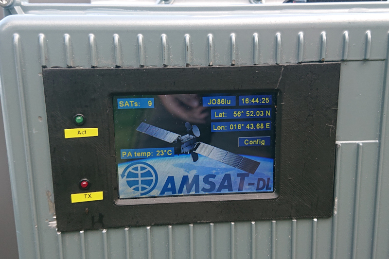
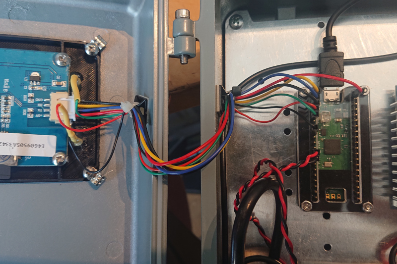

# ConverterDisplay
Nextion TFT display control for AMSAT-DL Es'Hail2 QO-100 Up/Down Converters



This is a project that aims to be a display solution for [AMSAT-DL](https://www.amsat-dl.org)'s up- and downconverters. The core is a Raspberry Pi Pico that reads the data from the converters and controls the Nextion TFT display. Sources for the Nextion display can be found in the [Nextion](Nextion) folder.

## Wiring

The Raspberry Pi Pico has two UARTs. UART0 is used to connect the serial interface of the Nextion display. UART1 is used for receiving data from the converters. This is a read-only interface so only RX line is used here. The wiring between RPi and Nextion TFT is:

```
Nextion            RPi
5V        ---      40
TX        ---       2
RX        ---       1
GND       ---       3
```

The serial interface of the converters is connected to UART1 RX. The wiring is simply:

```
Converter          RPi
TX        ---      12
GND       ---      13
```

The two converters are daisy-chained meaning the serial TX of the up converter is wired to the serial RX of the down converter and serial TX of the down converter is connected to the UART1 RX of the Raspberry Pi Pico.

In addition to that the code can control two LEDs. GP2 (pin 4) is a red LED lighting up when the unit is transmitting. GP3 (pin 5) is a green LED that flashes everytime serial data is received from the converters. Wiring for the LEDs is:

```
LED                RPi
red (+)   ---       4
green (+) ---       5
GND       ---       8
```



## Nextion Display

The code for the Nextion display is provided as source as well as a compiled binary (ConverterDisplay.tft). The .tft file can be uploaded to the display either via the Nextion Editor of through copying the file to a microSD card and flashing the display from the card.

## Known Issues

The v1.0 of the up converter firmware sends the configuration parameters on the serial line only once and directly after start. At this point of time the Raspberry Pi Pico is not started yet. Thus I provided a patch and created a pull request to the repository. In order to use this code you have to be able to compile and upload the patched code yourself until this is included in the official code.
